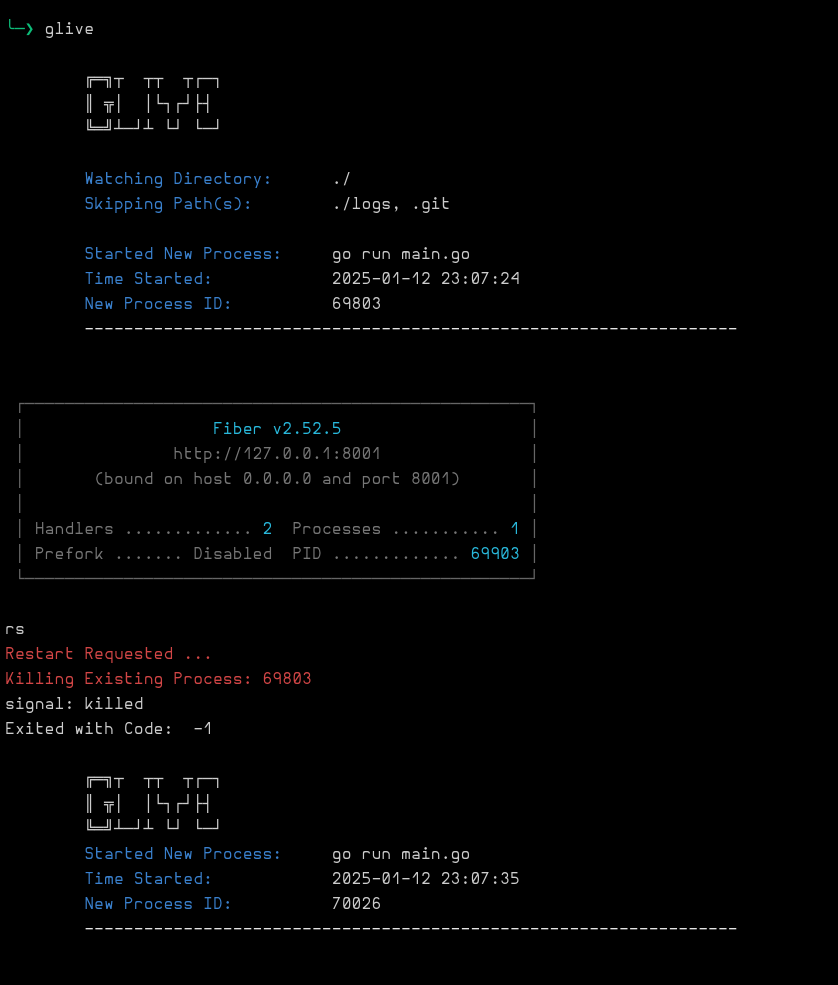
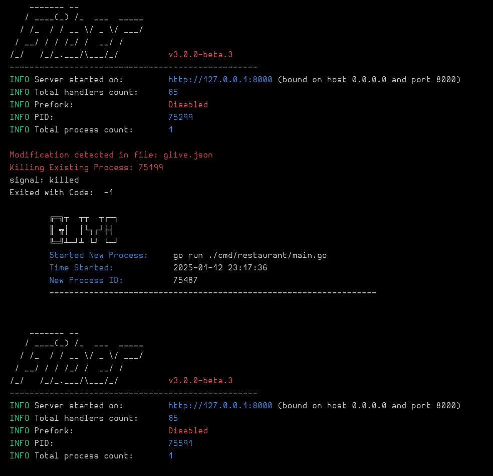

# GLIVE

## Directory / File Watcher & Process Reloader

My reason to write this, was being able to have the instructions in a file: as part of `git`, and just run a one word command, to start the server and start building. Since I would always forget the command, this saves me a lot of hassle, every day when setting up the dev environment. Also when running, multi threaded processes like `Fiber` or `Gin` servers, had problems closing properly with other solutions out there, and would use too much memory after a few restarts.

## Features:

- You can use with any platform like Nodejs, Golang, Python etc.
- Watch any directory.
- Run Multi Threaded processes like Fiber / Gin / Other ...
- Skip Directories or Files.
- Super fast, as built in Golang.
- Easy installation.
- No dependencies.

## Screenshots
### Manual Restart


### File Change


## Example Config File:

Create a `glive.json` file in working directory like below.

```json
{
  "watch": "./",
  "command": "go run ./cmd/app1/main.go",
  "skip": ["./logs", ".git", "./offProject/notes.md", "glive.json", "./docs"]
}
```

## Usage:

`glive` to Run,`rs` "while running" For Manually Restart,`Ctrl+c` To Stop

## Installation

### Method A:

> Using the Debian Package Manager / apt / apt-get.

#### 1. Downlaod the "Debian Pkg":

```sh
wget curl https://github.com/clubcleaver/glive/raw/refs/heads/main/glive.deb
sudo apt install ./glive.deb
```

#### 2. Use GLIVE

```sh
glive
```

---

### Mehod B:

> Manual Install

#### 1. Downlaod the "Binary File":

```sh
curl -O https://github.com/clubcleaver/glive/raw/refs/heads/main/glive
```

###### OR

```
wget curl https://github.com/clubcleaver/glive/raw/refs/heads/main/glive
```

#### 2. Change file permissions

```sh
chmod 777 ./glive
```

#### 3. Add the file location to your $PATH.

```sh
export $PATH=$PATH:<path-to-glive-file>
```

#### 4. Use GLIVE

```sh
glive
```

---
